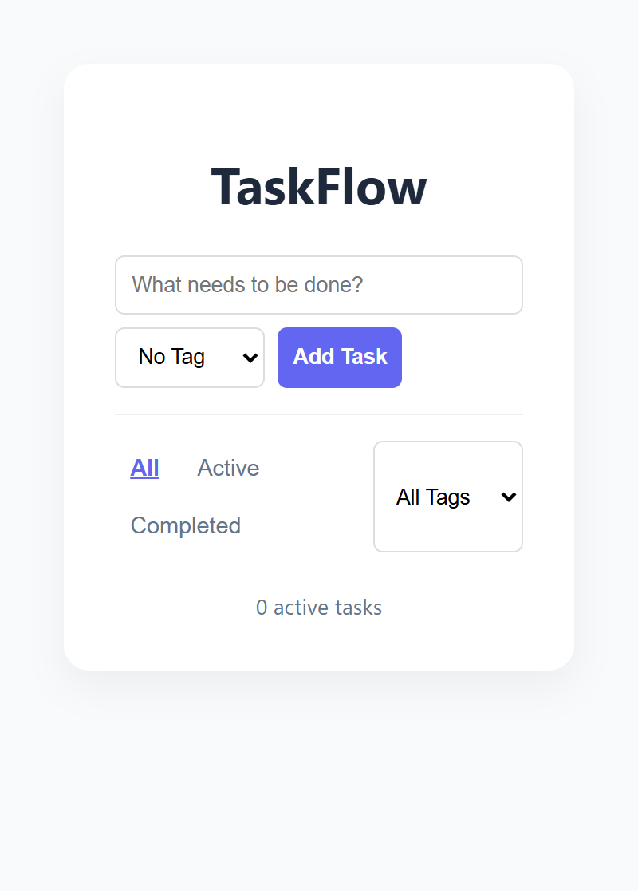
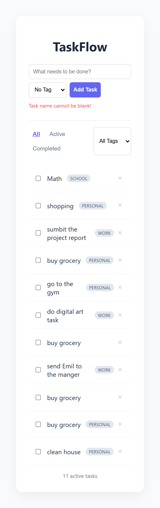

 To-Do List App 

A modern, functional To-Do list application built with HTML, CSS, and JavaScript. This project supports task management, categorization through tags, and persistent data storage.

## ✨ Features
 **Add Tasks**: Create tasks with a required name and an optional tag (School, Work, Personal).
**Persistence**: Uses `localStorage` to ensure tasks remain saved even after refreshing the browser.
**Filtering**: 
    Filter by status: All, Active, or Completed .
  Filter by category: Dropdown menu to view tasks by specific tags.
**Validation**: Prevents empty tasks with a real-time error message.
**Task Counter**: Displays the total number of active tasks remaining.
**Management**: Mark tasks as complete or delete them permanently.

## 📸 Screenshot
### Desktop View

## Links
* **GitHub Repository:** https://github.com/Nermeenbolous/To-Do-List
* **GitHub Pages Live Site:** https://nermeenbolous.github.io/To-Do-List/

## 🛠️ Built With
* HTML5
* CSS3
* JavaScript
